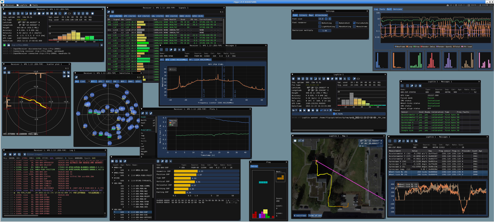

# cfggui

## Overview

This is a *very experimental* GUI for controlling u-blox 9 (and perhaps later ones) positioning receivers, analysing
data, recording and replaying logs.



## Building

This needs Linux. It won't work on Windoze. We need gcc (>= 8.0, maybe >= 10.0) and GNU libc.
A recent Ubuntu (20.04 or later) should work.

Install dependencies:

```sh
sudo apt-get install libcurl4-gnutls-dev libglfw3-dev libfreetype6-dev libglu1-mesa-dev zlib1g-dev libglm-dev gcc g++ # or libcurl4-openssl-dev
```

Build:

```sh
make cfggui -j8
```

On older Ubuntus you may be able to get it to work as follows:

```sh
sudo apt install libcurl4-gnutls-dev libglfw3-dev libfreetype6-dev libglu1-mesa-dev zlib1g-dev libglm-dev gcc-8 g++-8 # or libcurl4-openssl-dev
make cfggui CC=gcc-8 CXX=gcc-8
```

If it fails at compiler warnings, try disabling them (remove `-Werror` from Makefile).

YMMV.

Debugging gui: `LIBGL_SHOW_FPS=1 LIBGL_DEBUG=verbose ./output/cfggui-release` (<https://docs.mesa3d.org/envvars.html>)

## Licenses

* Various third-party code comes with its own license, see [`3rdparty/`](./3rdparty) and below
* Definitions for various maps are built into the cfggui. Check if the licenses cover your use!
  See [`mapparams.cpp`](./cfggui/stuff/mapparams.cpp).

See the [main README](../README.md) for more.

## Third-party code

The GUI uses the following third-party code:

* _Dear ImGui_ (<https://github.com/ocornut/imgui>), see [3rdparty/imgui/](./3rdparty/imgui/)
* _ImPlot_ (<https://github.com/epezent/implot>), see [3rdparty/implot/](./3rdparty/implot/)
* _PlatformFolders_ (<https://github.com/sago007/PlatformFolders>), see [3rdparty/stuff/](./3rdparty/stuff/)
* _DejaVu_ fonts (<https://dejavu-fonts.github.io/>), see [3rdparty/fonts/](./3rdparty/fonts/)
* _ProggyClean_ font (<https://proggyfonts.net>), see [3rdparty/fonts/](./3rdparty/fonts/)
* _ForkAwesome_ font (<https://forkaweso.me/Fork-Awesome/>), see [3rdparty/fonts/](./3rdparty/fonts/)
* _GLFW_ (<https://www.glfw.org/>), dynamically linked
* _libcurl_ (<https://curl.se/>), dynamically linked
* _Freetype_ (<https://freetype.org/>), dynamically linked
* _zlib_ (<https://zlib.net/>), dynamically linked
* _glm_ (<https://github.com/g-truc/glm>)
* And a bunch of other libraries that GLFW, Freetype, ImGui, libcurl etc. need...

See the [main README](../README.md) for more.

## TODOs, ideas

* Implement Logfile::Read(), Seek(), Tell(), Size(), and gzipped read/write/seek/tell/size
* Make database size dynamic / configurable
* Navigation status page (same stuff as in input window + velocity gage, artificial horizon, etc.)?
* Button to open/arrange all data windows?
* Implement A-GNSS
* Add epoch rate [Hz] to nav status (also for logfile!)
* Messages data win: show tree anyway if hidden but selected message not present (until it is present...)
* Clear all settings (on next restart) option
* Custom message: implement RTCM3
* Custom message: load from / save to file, load from clipboard? sw itch to right tab depending on what message it is?
* Fix docking troubles in GuiWinInput::DrawWindow(), disallow some centre dockings
* Improve GuiWinDataPlot, e.g. markers, lines, lines+markers, ...
* Handle database reset (insert blank epoch?) when seeking in logfile
* File dialog: load dir entries async, and as needed (make _RefreshDir() run in background)
* (started) Implement epoch info page (table with all details / fields of EPOCH_t etc.)
* FIXMEs and TODOs all over...
* Deque for Database
* Application crashes if (e.g. receiver) thread  is running on close. Explicitly calling _receiver->Stop() in
  GuiWinInputReceiver::~GuiWinInputReceiver(). Maybe this is now fixed with the GuiSettings rework.
  seems to help (and in ~GuiWinInputLogfile)
* GuiWinDataConfig needs some love, and the new tables..
* Stringify UBX-NAV-TIME*
* Gzipped read: maybe replace by gunzipping file into cache dir and then use that?
  Hmmm... lots of implications with the "immediate" in imgui.. :-/
  Can we implement seekpos()? Maybe re-open file at a certain position? And gzseek() is commented-out in zlib.h anyway... (?!)
* Fix memory leaks... valgrind isn't too happy.. :-/
* Use GuiWidgetTable for GuiWinDataEpoch
* Use Ff::Thread in GuiWinPlay
* Write parser for swisstopo wmts capabilities xml to generate mapparams
* Maybe use some global event queue for all input data stuff and have the data windows subscribe (to one or multiple sources)

* Check out stuff here: <https://github.com/mahilab/mahi-gui>
* Check out <https://github.com/bkaradzic/bgfx>
* Check out <https://github.com/jnmaloney/WebGui>
* Checkout icons in <https://github.com/leiradel/ImGuiAl/tree/master/fonts>
* <https://gist.github.com/gorbatschow/ce36c15d9265b61d12a1be1783bf0abf>
* Checkout <https://github.com/CedricGuillemet/ImGuizmo>

